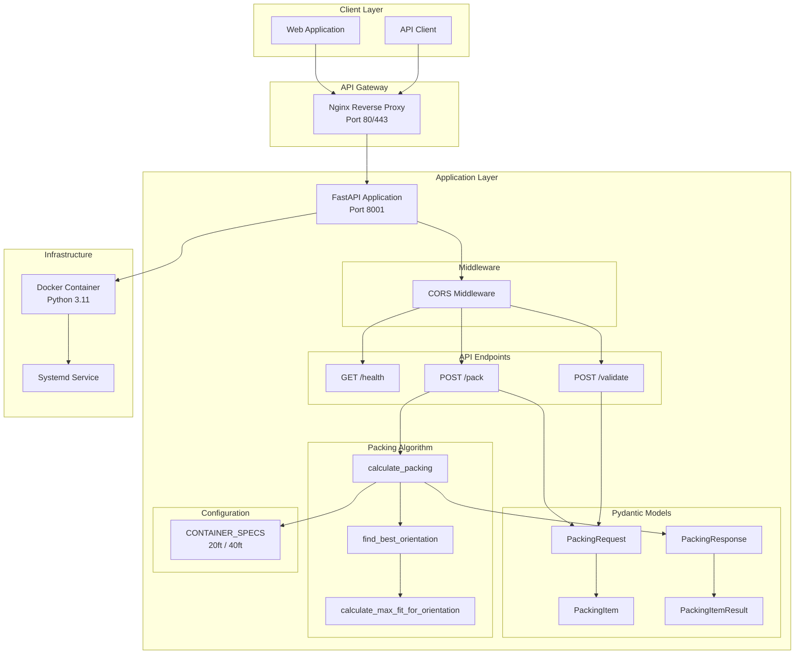
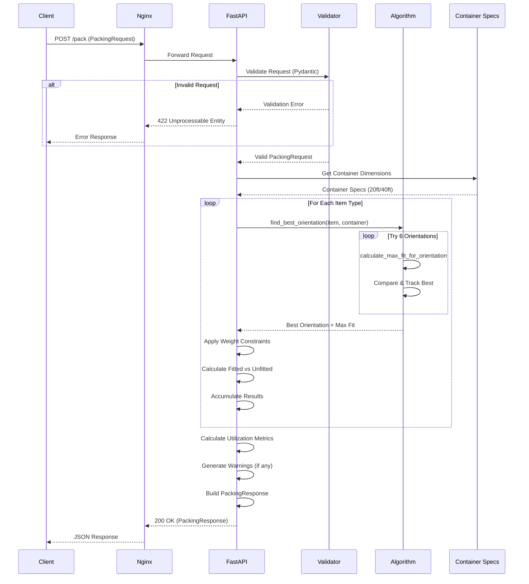
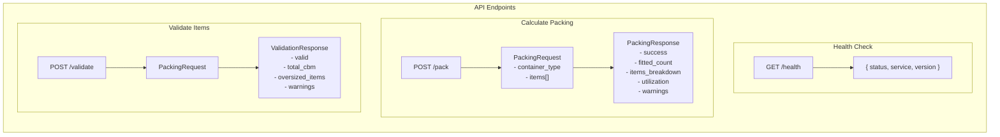
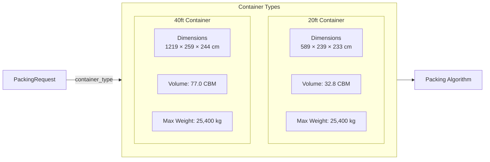
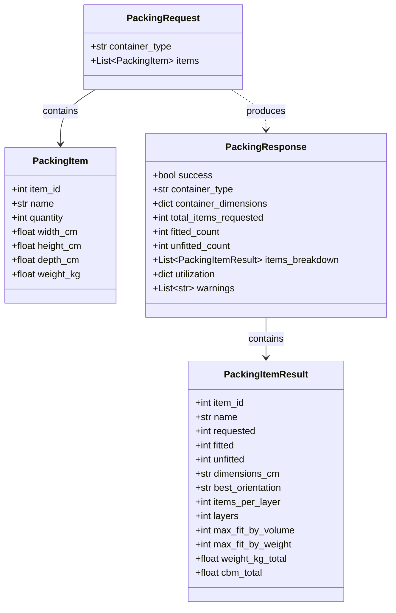
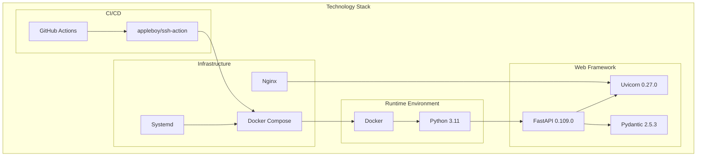

# DMP Container Packing Service - Architecture

This document provides visual diagrams of the DMP Container Packing Service architecture, data flow, and deployment pipeline.

## System Architecture



## Data Flow - Packing Calculation



## API Endpoints



## Packing Algorithm Flow

```mermaid
flowchart TD
    START([Start]) --> PARSE[Parse Request]
    PARSE --> GET_CONTAINER[Get Container Specs]
    GET_CONTAINER --> INIT[Initialize Counters<br/>remaining_weight, used_volume]

    INIT --> LOOP{For Each<br/>Item Type}

    LOOP --> CHECK_SIZE{Item Fits<br/>Container?}

    CHECK_SIZE -->|No| WARN_SIZE[Add Oversized Warning]
    WARN_SIZE --> SKIP[Skip Item]
    SKIP --> NEXT

    CHECK_SIZE -->|Yes| ORIENT[Find Best Orientation]

    subgraph Orientation["Orientation Testing"]
        ORIENT --> TRY1[Try W×H×D]
        ORIENT --> TRY2[Try W×D×H]
        ORIENT --> TRY3[Try H×W×D]
        ORIENT --> TRY4[Try H×D×W]
        ORIENT --> TRY5[Try D×W×H]
        ORIENT --> TRY6[Try D×H×W]
        TRY1 & TRY2 & TRY3 & TRY4 & TRY5 & TRY6 --> BEST[Select Best<br/>Max Items]
    end

    BEST --> CALC_VOL[Calculate Max by Volume]
    CALC_VOL --> CALC_WT[Calculate Max by Weight]
    CALC_WT --> MIN_FIT[Fit = min(volume, weight, requested)]

    MIN_FIT --> UPDATE[Update Counters<br/>- remaining_weight<br/>- used_volume<br/>- fitted_count]

    UPDATE --> RESULT[Create ItemResult]
    RESULT --> NEXT{More Items?}

    NEXT -->|Yes| LOOP
    NEXT -->|No| UTIL[Calculate Utilization %]

    UTIL --> WARNINGS{Check Thresholds}
    WARNINGS -->|>95% Volume| W1[Add Volume Warning]
    WARNINGS -->|>95% Weight| W2[Add Weight Warning]
    W1 & W2 --> BUILD
    WARNINGS -->|OK| BUILD[Build PackingResponse]

    BUILD --> END([Return Response])
```

## Container Specifications



## Deployment Pipeline

```mermaid
flowchart LR
    subgraph Development["Development"]
        CODE[Code Changes]
        COMMIT[Git Commit]
        PUSH[Git Push]
    end

    subgraph GitHub["GitHub"]
        REPO[Repository]
        ACTIONS[GitHub Actions]

        subgraph Workflow["Deploy Workflow"]
            TRIGGER[Push to main/master]
            SSH[SSH to VPS]
        end
    end

    subgraph VPS["Hostinger VPS"]
        GIT_PULL[git pull origin main]
        COMPOSE[docker compose up]

        subgraph Docker["Docker Environment"]
            BUILD[Build Image]
            CONTAINER[Python 3.11 Container]
            UVICORN[Uvicorn Server<br/>Port 8001]
        end

        subgraph Proxy["Reverse Proxy"]
            NGINX_CONF[Nginx Config]
            NGINX_RUN[Nginx Service]
        end
    end

    subgraph Public["Public Access"]
        ENDPOINT["/packing/*"]
    end

    CODE --> COMMIT --> PUSH
    PUSH --> REPO
    REPO --> ACTIONS
    ACTIONS --> TRIGGER
    TRIGGER --> SSH
    SSH --> GIT_PULL
    GIT_PULL --> COMPOSE
    COMPOSE --> BUILD
    BUILD --> CONTAINER
    CONTAINER --> UVICORN
    UVICORN --> NGINX_RUN
    NGINX_CONF --> NGINX_RUN
    NGINX_RUN --> ENDPOINT
```



## Request/Response Models



## Technology Stack



---

*This document is automatically validated on every push to ensure diagrams remain in sync with the codebase.*
